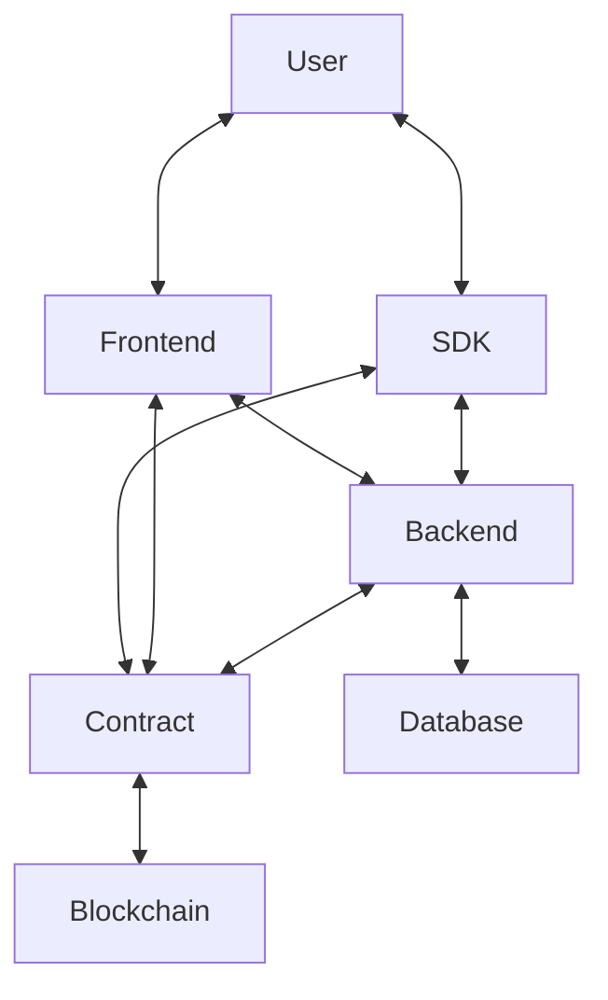

# B2B Rewards Platform for Solana Hackathon

## Architecture

* Frontend: Vue.js 3 with Vuetify
* Backend: Rust with Actix-web and Diesel
* Database: Postgresql
* Deployment: Kubernetes
* Contracts: Anchor
* Blockchain: Solana
* Repository: Github
* CI/CD: Github Actions

### Flow

1. user creates an account on the frontend.
2. user creates a new campaign on the frontend.
3. user submits the campaign to the backend and sends proof of annual revenue for verification purposes.
4. backend verifies the proof of annual revenue using third party verification providers.
5. backend creates a new ERC-1155 contract on the blockchain.
6. ERC-1155 contract contains users as NFTS and an amount of reward tokens.

